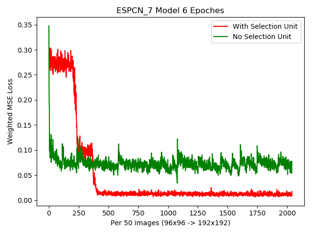

# Waifu2x

 Re-implementation on the original [waifu2x](https://github.com/nagadomi/waifu2x) in PyTorch with additional models. 
 
 ## Details
 Models are trained on rgb based on a [waifu2x's discussion](https://github.com/nagadomi/waifu2x/issues/92). 
 
 ### Loss
The loss function is weighted MSE with weights [0.29891, 0.58661, 0.11448] on RGB channels. Please see [waifu2x's source code](https://github.com/nagadomi/waifu2x/blob/master/train.lua#L109) and a [blog post](https://blog.csdn.net/AIchipmunk/article/details/53704139).  The weights come from the image transform from RGB to gray scale.
 
 L1 seems to be more robust and converges faster than MSE. Need more test. 
 
 ### Image Processing
 High resolution PNGs are cropped into 192x192 non-overlapping patches, so some parts of images are dropped. A lesson I learn is that DON'T save processed patches. I save over 2x80 thousands small patches (both high and low resolution), and I fail to open the folder. 
 
 High resolution images are loaded all at once in memory and cut into patches. Low resolution patches are also saved in  memory. They are then dumped into PyTorch's dataloader and feed into the neural net. 
 

 
Low resolution images are shrunk by BICUBIC and  re-encoded into JPEG format, which is very common for low quality Anime style images. Noise factor is added via changing the quality value when re-encoding image. 
 
 ## Models
 

 #### ESPCN_7
Modified from [Real-Time Single Image and Video Super-Resolution Using an Efficient Sub-Pixel Convolutional Neural Network](https://arxiv.org/abs/1609.05158).  Computations are done on the low resolution images, and the  last layer is Pixel Shuffle that scale up the input image. 

A selection unit is added in between of convolutional filters.  Details on the selection unit can be found in [A Deep Convolutional Neural Network with Selection Units for Super-Resolution](http://openaccess.thecvf.com/content_cvpr_2017_workshops/w12/papers/Choi_A_Deep_Convolutional_CVPR_2017_paper.pdf). But the activation function is changed to SELU. It seems quite powerful.

 

 
 In Google's colaboratory environment (GPU K-80), an iteration on 50 images (96x96 -> 192x192) is around 2.8s with around 5 GB GPU memory usage. 
 

 ###
 DCSCN is very interesting as it  has relatively quick forward computation, and  both the shallow model (layerr 8) and deep model (layer 12) are quick to train.
 
 SELU is a good drop in replacement for PReLu with L1 & MSE loss. Under SELU, dropout, alpha dropout, gradient clipping and batch norm have negative impact on this model. 
 
 
 ## TODO: 
 * Rewrite: split image into pieces and dump in a model, then merge the output without "grids" effect. 
 
 * [DRRN](http://cvlab.cse.msu.edu/pdfs/Tai_Yang_Liu_CVPR2017.pdf) (planned)
 (Note: DRRN is not realistic for CPU only usage. A modified version might be used.)
 * and find some interesting paper
 
 